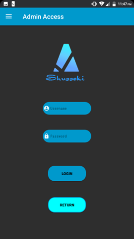
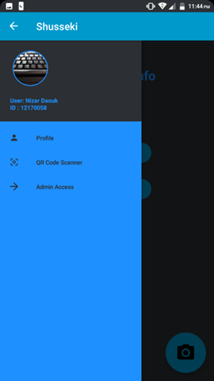
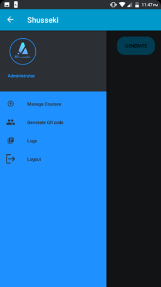
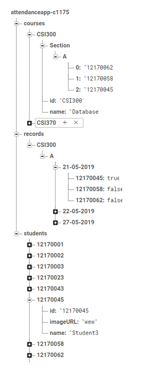
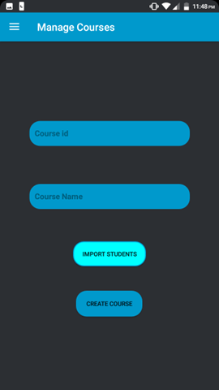
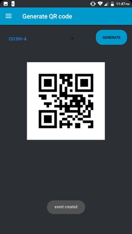
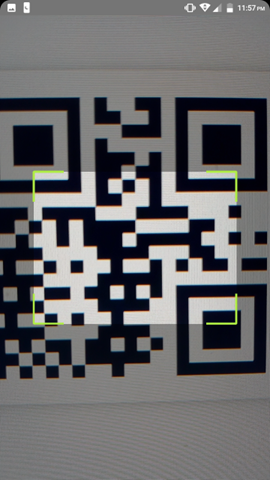
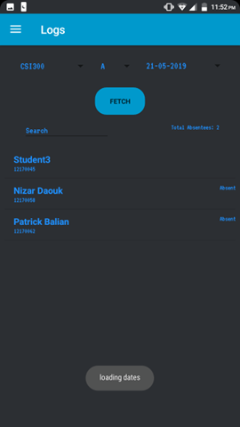

  

A proposed solution for classrooms looking to facilitate the attendance management and taking process for both instructors and students.

# Features

## Accounts Login

## Menus for Students and Instructors
### Students

### Instructor

## Syncing and Storage using Firebase DB

## Easy Course Management

## Attendee List Importing As Excel Sheets

## Unique and Secure QR code generation

## QR code scanning for quick checking in

## Logging System With Editing and Querying

